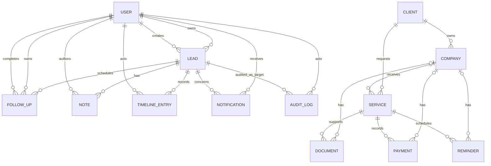

# Release 1 Entity-Relationship Model

## 1. Conceptual Diagram

## 2. Cardinality and Ownership

- A Lead has zero or one current owner; only a `NEW` Lead may be unowned.
- One Agent may own many active Leads.
- A Lead may have unlimited Follow-ups, Notes, and Timeline entries.
- A scheduled Follow-up has one current owner.
- A User may be deactivated but historical references to that User remain.
- A Notification belongs to one recipient and concerns one Lead in Release 1.
- Audit targets are polymorphic: Lead, Follow-up, Note, Notification, or User.
- A Client may own many Companies, and every Company belongs to one Client.
- A Client may request many Services, and each Service belongs to one Client.
  A Service and its Documents, Payments, and Reminders reference a Company
  only when the Client Service package includes one.

## 3. Aggregate Boundaries

Lead is the consistency root for ownership and status. Follow-up is separately
versioned but operations that change the Lead's derived next action lock/check
the Lead version in the same transaction. Timeline, Audit, and Notification
records are side effects, not children that callers can replace.

## 4. Deliberate Omissions

Customer, Insurance Company, Insurance Plan, Quotation, Policy, Renewal, Claim,
Document, Task, Activity Log, and Organization are not Release 1 entities.
Future relationships must be added without converting the Lead record into a
Customer or putting Policy/Renewal/Claim state on the Lead.
